# cocommit

**How much of your git history did you write with an AI agent?**



Other tools count how much you *talked* to an AI — tokens spent, sessions
opened, transcripts on disk. `cocommit` counts what you *shipped together*:
commits carrying a `Co-authored-by:` trailer, as recorded in git history.

The difference matters. A token count is a private number that disappears when
you change laptops and that nobody else can check. A co-authored commit is a
fact in your repository's history. Anyone can verify it:

```console
$ git log --format='%b' | grep -c 'Co-Authored-By: Claude'
```

## Install

Nothing to install — it has no dependencies and runs straight from source.

```console
$ GITHUB_TOKEN=ghp_... npx github:yosh1/cocommit --user your-login
```

You need a [personal access token][pat] with the **`repo`** scope. Without it
the search API cannot see your private repositories, and for most people that
is where nearly all of the work lives.

[pat]: https://github.com/settings/tokens

## Put it on your profile

Add the workflow to the repository named after your GitHub username — the one
that renders as your profile — then reference the committed SVG from its
README.

1. Copy [`.github/workflows/cocommit.yml`](.github/workflows/cocommit.yml)
   into that repository.
2. Add a repository secret named `COCOMMIT_TOKEN` holding your PAT.
3. Reference the card from your README:

```markdown

```

4. Run the workflow once from the Actions tab. After that it refreshes daily.

The card is committed to your own repository, so GitHub serves it from there.
There is no service to sign up for, no server to stay up, and no third party
holding a token that can read your private code.

## What leaves your repositories

Only counts. The card contains your username, two totals, a percentage, and a
commit count per month. Repository names, commit messages, diffs, and
collaborators are never read — the tool asks the search API for
`total_count` and nothing else, and never enumerates a single commit.

Counting private work is the default because that is where most people's
history is. If you would rather measure only public repositories, pass
`--visibility public`.

## Options

```
--user <login>       GitHub user to measure (default: token owner)
--agent <name>       claude | copilot (default: claude)
--out <path>         SVG output path (default: cocommit.svg)
--json <path>        also write the raw counts as JSON
--theme <name>       dark | light | claude (default: dark)
--months <n>         months in the bar chart, 1-24 (default: 12)
--visibility <what>  all | public (default: all)
--title <text>       override the card heading
--no-animate         render a static card
```

### Themes

| `dark` | `light` | `claude` |
|---|---|---|
|  |  |  |

## How it works, and where it can be wrong

Each run asks the [commit search API][search] for a count, twice for the
totals and twice per month in the chart — 26 requests for the default twelve
months. Search is limited to 30 requests per minute, so a run takes about a
minute and is paced to stay inside the limit.

[search]: https://docs.github.com/en/search-github/searching-commits

Three caveats worth knowing:

**The qualifier is undocumented.** `co-authored-by:` works — a query for
`co-authored-by:copilot@github.com` returns a different count than one for
Claude, and an invented qualifier returns zero — but GitHub does not document
it, so it could change. When the qualifier stops filtering, the count comes
back either empty or equal to your unfiltered total; `cocommit` detects both
and falls back to matching the trailer as literal text.

**The search index lags.** Commits pushed minutes ago may not be counted yet.
Since the workflow runs daily, this is invisible in practice.

**It measures trailers, not effort.** A commit counts the same whether the
agent wrote one line or the whole file, and commits made without the trailer
do not count at all. It is a measure of how you worked, not of how much the
machine contributed.

## Development

```console
$ npm test
```

The tests cover the counting logic, the fallback, and the SVG contract —
including that the card carries no script, no external font, and no external
image, since GitHub's image proxy blocks all three.

## License

MIT
